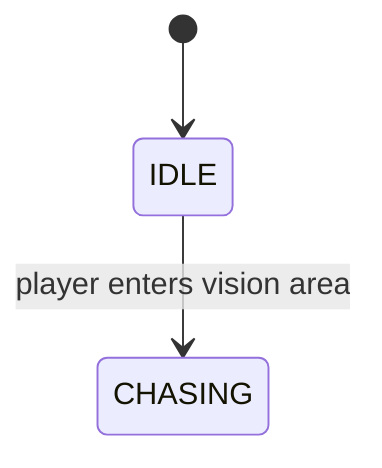

# NPC

`NPC.gd` is a `CharacterBody3D` that runs a simple enum-based state machine. Each state has an `_enter_*` function (called once on transition) and a `_tick_*` function (called every `_physics_process` frame).

## State machine

## States

| State | Behaviour |
|---|---|
| `IDLE` | Stationary, waiting for a trigger. |
| `CHASING` | Moves toward `target` at `speed` m/s, rotating the model to face it each frame. |

## Key properties

- `speed` — movement speed (exported, default `3.0`).
- `target` — the `Node3D` being pursued; set when the player enters the vision area.

## How vision works

The vision area is an `Area3D` child node. Its `body_entered` signal is wired to `_on_vision_area_body_entered`, which checks for the `"player"` group and triggers the `IDLE → CHASING` transition.
