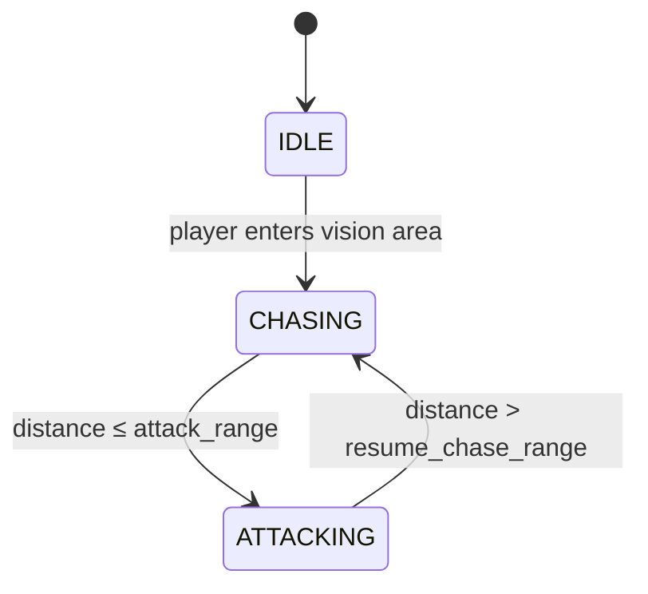

# NPC

`NPC.gd` is a `CharacterBody3D` that runs a simple enum-based state machine. Each state has an `_enter_*` function (called once on transition) and a `_tick_*` function (called every `_physics_process` frame).

## State machine

## States

| State | Behaviour |
|---|---|
| `IDLE` | Stationary, waiting for a trigger. |
| `CHASING` | Moves toward `target` at `speed` m/s, rotating the model to face it each frame. Transitions to `ATTACKING` when within `attack_range`. |
| `ATTACKING` | Stops moving, faces `target`, and fires the weapon each frame. Transitions back to `CHASING` when `target` moves beyond `resume_chase_range`. |

## Key properties

- `speed` — movement speed (exported, default `3.0`).
- `attack_range` — distance at which the NPC stops chasing and starts attacking (exported, default `2.0`).
- `resume_chase_range` — distance at which the NPC stops attacking and resumes chasing (exported, default `3.0`). Must be ≥ `attack_range` to avoid state flickering.
- `target` — the `Node3D` being pursued; set when the player enters the vision area.
- `weapon` — optional `Weapon` child node at `Model/Weapon`; called via `weapon.fire()` each frame while attacking.

## How vision works

The vision area is an `Area3D` child node. Its `body_entered` signal is wired to `_on_vision_area_body_entered`, which checks for the `"player"` group and triggers the `IDLE → CHASING` transition.
