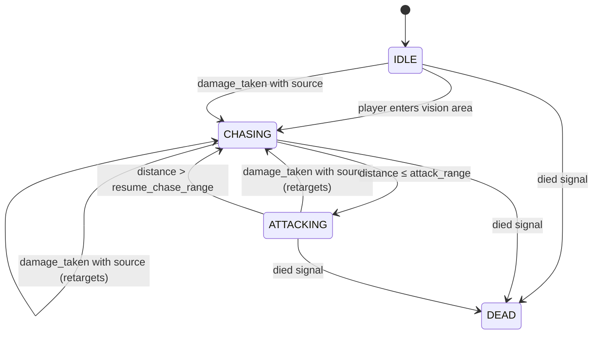

# NPC

`NPC.gd` is a `CharacterBody3D` that runs a simple enum-based state machine. Each state has an `_enter_*` function (called once on transition) and a `_tick_*` function (called every `_physics_process` frame).

## State machine

## States

| State | Behaviour |
|---|---|
| `IDLE` | Stationary, waiting for a trigger. |
| `CHASING` | Moves toward `target` at `speed` m/s, rotating the model to face it each frame. Transitions to `ATTACKING` when within `attack_range`. |
| `ATTACKING` | Stops moving, faces `target`, and fires the weapon each frame. Transitions back to `CHASING` when `target` moves beyond `resume_chase_range`. |
| `DEAD` | Terminal. Stops moving, releases the weapon (via the `ATTACKING` exit), plays the death animation, and ignores further vision triggers. |

## Key properties

- `speed` — movement speed (exported, default `3.0`).
- `attack_range` — distance at which the NPC stops chasing and starts attacking (exported, default `2.0`).
- `resume_chase_range` — distance at which the NPC stops attacking and resumes chasing (exported, default `3.0`). Must be ≥ `attack_range` to avoid state flickering.
- `target` — the `Node3D` being pursued; set when the player enters the vision area.
- `weapon` — optional `Weapon` child node at `Model/Weapon`; called via `weapon.fire()` each frame while attacking.

## How the NPC acquires a target

**Vision:** An `Area3D` child node fires `body_entered` → `_on_vision_area_body_entered`. Only reacts when the NPC is in `IDLE` and the body is in the `"player"` group; sets `target` and triggers `IDLE → CHASING`.

**Damage:** When the NPC takes damage from a source (a `Node3D` passed through `damage_taken`), it sets `target = source` and transitions to `CHASING` (from any non-`DEAD` state). Damage with no source (`null`) is ignored for targeting — the NPC plays the pulse animation but does not move.
